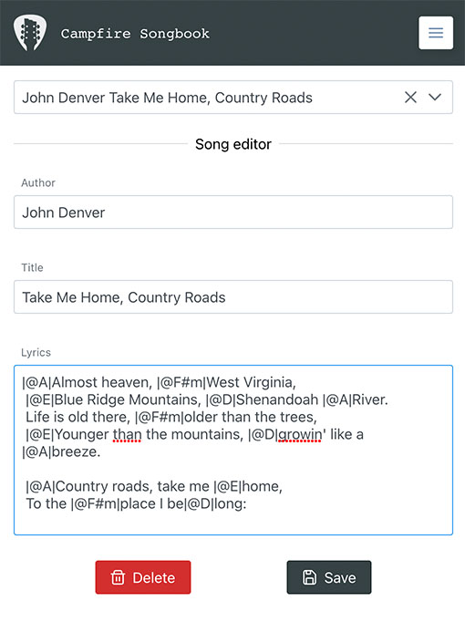

# Campfire Songbook

### Description

Interactive songbook web based application for campfire events. 
It allows creating multiple sessions as host or join to existing one.
Host can choose and select a song which will be updated immediately on screen of joined people.

### Features

- Lightweight and mobile UI friendly
- Filtering and sorting songs by author or title
- Chord diagrams for guitar and ukulele
- Transposing chords
- Searching and saving songs from the Internet
- Song lyrics and chords editor
- Play selected song on YouTube
- Share url to current session as guest
- Password protected session as host
- Multilingual support
- Changeable font size
- Built in database with stored songs

### Screenshots

Home screen - create session as host or join as guest


Host screen - chords view with song lyrics


Song preview with saving to local db and selecting as current song


Horizontal screen with example chord diagram (with switchable variations)


Preferences screen with language, instrument (guitar / ukulele) and font size options 


Song editor screen - creating, updating and deleting songs



### To do:

- [x] Scroll to top after song being changed in guest mode
- [ ] More sources for external search integration
- [ ] Prevent screen for dimming
- [ ] Favourite songs for session
- [ ] Playlist for session
- [ ] PWA integration
- [ ] Highlighting chords in song editor

### Tech stack

#### Backend

- Java
- Spring Boot, JPA - https://spring.io/projects/spring-boot
- REST - https://restfulapi.net
- Lombok - https://projectlombok.org
- Swagger - https://swagger.io
- JSoup - https://jsoup.org
- H2 database - https://www.h2database.com
- Websockets

#### Frontend

- React - https://github.com/facebook/react
- Prime Faces UI - https://github.com/primefaces/primereact
- Axios - https://github.com/axios/axios
- Formik - https://github.com/formium/formik
- React i18next - https://github.com/i18next/react-i18next
- React Stomp - https://github.com/lahsivjar/react-stomp
- React Chords with json db - https://github.com/tombatossals/react-chords https://github.com/tombatossals/chords-db
- React Player - https://github.com/cookpete/react-player
- Prettier - https://github.com/prettier/prettier
- Typescript - https://github.com/microsoft/TypeScript

### Deployment

[Caddy 2 ](https://caddyserver.com/) is a powerful, enterprise-ready, open source web server with automatic HTTPS written in Go. 
It uses Let's Encrypt certificate and allows easily configure server with one simple file.

Caddyfile:

```
example.com {
        templates
        encode gzip zstd
        reverse_proxy /api/* localhost:8090
        reverse_proxy /ws/* localhost:8090
        root * /var/www/html
        @notAPI {
                not {
                        path /api/*
                }
                file {
                        try_files {path} {path}/ /index.html
                }
        }
        rewrite @notAPI {http.matchers.file.relative}
        file_server
}
```
